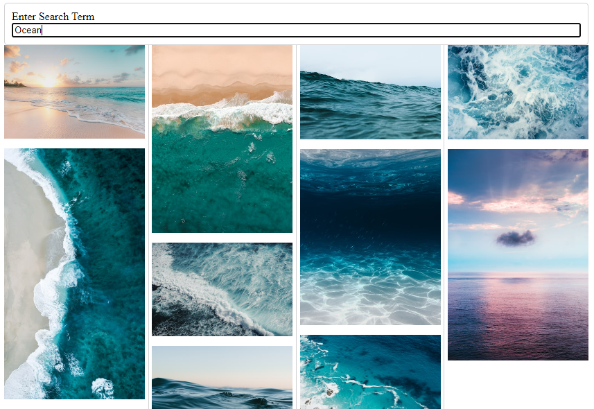

# Image Search Application
This is a simple web application that allows users to search for images using a keyword or phrase.

## How it works
When a user first visits the website, they will see a search bar at the top of the screen. Users can type in their search query, such as "cars", and hit enter.

Once the user hits enter, the application makes an API request to a third-party server that will return a list of images related to the search query. The images are then displayed in a grid on the screen.

Users can then change their search query by entering a new term into the search bar and pressing enter again. The application will make a new API request and display the results.

## API Used
This application uses the Unsplash API to search for images. Unsplash is a website that offers free high-resolution photos that can be used for any purpose. The API allows us to search for photos based on a keyword or phrase and returns a list of related images. Limited demonstration apps are limited to 50 requests per hour.

## Technologies Used
HTML
CSS
JavaScript
Third-party API

## How to Run
To run this application, simply open the index.html file in a web browser.

## Possible Future Improvements
Add pagination to display more images
Implement filtering options to narrow down search results
Improve user interface and user experience
Add support for different search engines

## Screenshot
